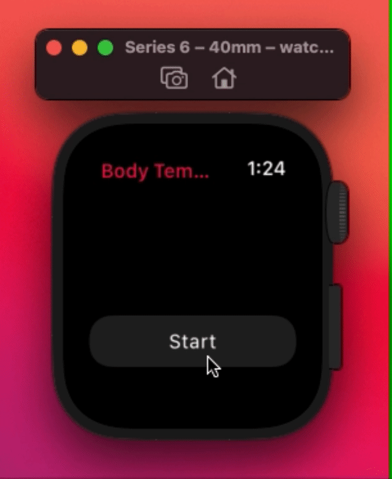

# Body Temperture

  

Body Temperture is the app that allows you to measure your body temperature on your Apple Watch (**it doesn't really do it**). If the Apple Watch had the abilliy to measure your body temperature, the UI of app would look like this app. UI is based on the [Blood Oxygen app](https://support.apple.com/en-us/HT211027) of Apple Watch.

  

## Requirements
- Xcode 12.0+
- watchOS 7.0+
